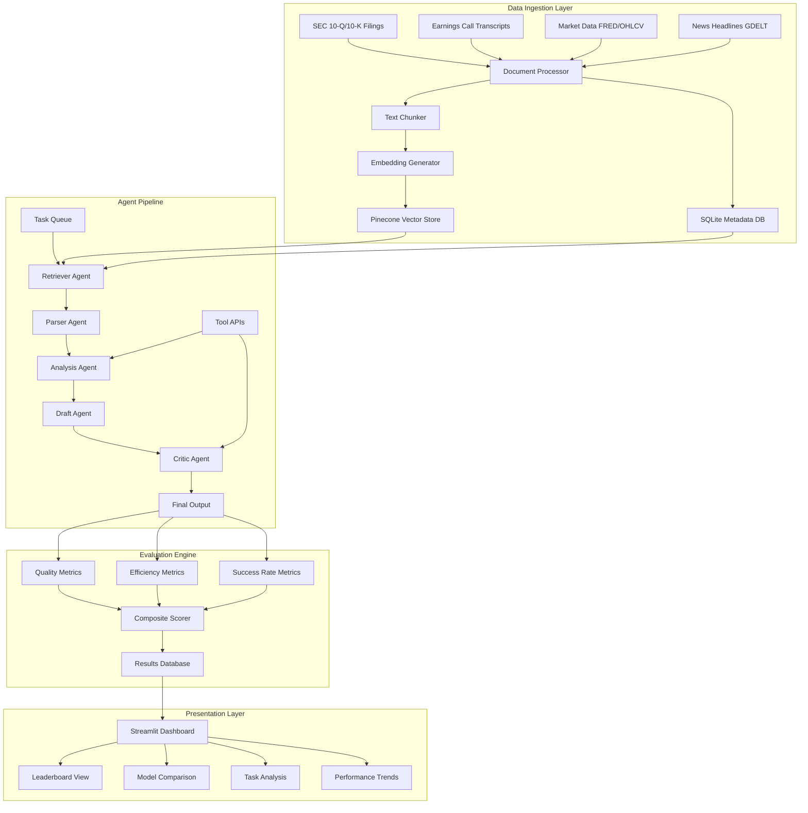
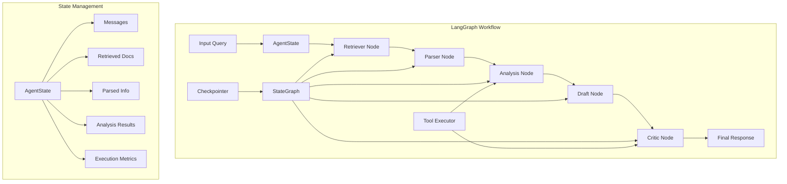

# LLM Finance Leaderboard - Architecture & Implementation Plan

## Overview

This document outlines the complete architecture and implementation plan for a reproducible LLM Finance Leaderboard that evaluates both stock checkpoints and fine-tuned models (LoRA/QLoRA) on G-SIB quarterly earnings analysis tasks.

## 1. Project Philosophy & Goals

### Core Principles
- **Task Realism**: Evaluate complete agent pipelines rather than isolated prompts
- **Three Difficulty Tiers**: Low (fact extraction), Medium (multi-doc analysis), Hard (causal reasoning)
- **Reproducibility**: Identical conditions across all model evaluations
- **Multi-faceted Scoring**: Quality + Efficiency + Success Rate metrics

### Success Metrics
- Accurate ranking of model performance on real-world financial analysis
- Reproducible benchmarks with deterministic results
- Cost-effective evaluation framework
- Scalable architecture for continuous evaluation

## 2. Repository Structure

```
llm-finance-leaderboard/
├── README.md
├── requirements.txt
├── docker-compose.yml
├── .env.example
├── .gitignore
├── pyproject.toml
│
├── src/
│   ├── __init__.py
│   ├── config/
│   │   ├── __init__.py
│   │   ├── settings.py
│   │   └── models_config.yaml
│   │
│   ├── data/
│   │   ├── __init__.py
│   │   ├── collectors/
│   │   │   ├── __init__.py
│   │   │   ├── sec_filings.py
│   │   │   ├── earnings_transcripts.py
│   │   │   ├── market_data.py
│   │   │   └── news_data.py
│   │   ├── processors/
│   │   │   ├── __init__.py
│   │   │   ├── document_parser.py
│   │   │   ├── embeddings.py
│   │   │   └── vector_store.py
│   │   └── schemas/
│   │       ├── __init__.py
│   │       └── data_models.py
│   │
│   ├── agents/
│   │   ├── __init__.py
│   │   ├── base_agent.py
│   │   ├── retriever_agent.py
│   │   ├── parser_agent.py
│   │   ├── analysis_agent.py
│   │   ├── draft_agent.py
│   │   ├── critic_agent.py
│   │   └── orchestrator.py
│   │
│   ├── tasks/
│   │   ├── __init__.py
│   │   ├── base_task.py
│   │   ├── low_complexity/
│   │   │   ├── __init__.py
│   │   │   ├── eps_extraction.py
│   │   │   └── ratio_identification.py
│   │   ├── medium_complexity/
│   │   │   ├── __init__.py
│   │   │   ├── revenue_analysis.py
│   │   │   └── sentiment_classification.py
│   │   └── high_complexity/
│   │       ├── __init__.py
│   │       ├── target_price_generation.py
│   │       └── divergence_analysis.py
│   │
│   ├── evaluation/
│   │   ├── __init__.py
│   │   ├── metrics/
│   │   │   ├── __init__.py
│   │   │   ├── quality_metrics.py
│   │   │   ├── efficiency_metrics.py
│   │   │   └── composite_scoring.py
│   │   ├── runners/
│   │   │   ├── __init__.py
│   │   │   ├── benchmark_runner.py
│   │   │   └── model_evaluator.py
│   │   └── validators/
│   │       ├── __init__.py
│   │       └── answer_validation.py
│   │
│   ├── models/
│   │   ├── __init__.py
│   │   ├── model_registry.py
│   │   ├── model_loader.py
│   │   └── fine_tuned_models/
│   │       └── __init__.py
│   │
│   └── utils/
│       ├── __init__.py
│       ├── logging_config.py
│       ├── database.py
│       └── helpers.py
│
├── streamlit_app/
│   ├── __init__.py
│   ├── main.py
│   ├── pages/
│   │   ├── __init__.py
│   │   ├── leaderboard.py
│   │   ├── model_comparison.py
│   │   ├── task_analysis.py
│   │   └── data_management.py
│   ├── components/
│   │   ├── __init__.py
│   │   ├── charts.py
│   │   ├── tables.py
│   │   └── metrics_display.py
│   └── assets/
│       ├── styles.css
│       └── images/
│
├── data/
│   ├── raw/
│   │   ├── sec_filings/
│   │   ├── earnings_transcripts/
│   │   ├── market_data/
│   │   └── news_data/
│   ├── processed/
│   │   ├── embeddings/
│   │   └── ground_truth/
│   └── results/
│       ├── benchmark_runs/
│       └── model_outputs/
│
├── tests/
│   ├── __init__.py
│   ├── unit/
│   │   ├── test_agents.py
│   │   ├── test_tasks.py
│   │   └── test_evaluation.py
│   ├── integration/
│   │   ├── test_pipeline.py
│   │   └── test_data_flow.py
│   └── fixtures/
│       └── sample_data.py
│
├── scripts/
│   ├── setup_environment.py
│   ├── data_collection.py
│   ├── run_benchmark.py
│   └── deploy.py
│
├── configs/
│   ├── benchmark_config.yaml
│   ├── model_configs/
│   │   ├── mistral_7b.yaml
│   │   ├── llama2_13b.yaml
│   │   └── custom_lora.yaml
│   └── task_configs/
│       ├── low_complexity.yaml
│       ├── medium_complexity.yaml
│       └── high_complexity.yaml
│
└── docs/
    ├── architecture.md
    ├── api_reference.md
    ├── deployment_guide.md
    └── contributing.md
```

## 3. System Architecture

### Data Flow Architecture



### LangGraph Agent Pipeline Architecture



## 4. Implementation Phases

### Phase 1: Core Infrastructure (Weeks 1-2)

#### Deliverables:
- Repository setup with complete folder structure
- Basic configuration management system
- Pinecone integration for vector storage
- SQLite schema for metadata and results
- Basic Streamlit application framework
- Docker containerization setup

#### Key Components:
```python
# src/config/settings.py
class Settings:
    PINECONE_API_KEY: str
    PINECONE_ENVIRONMENT: str
    EMBEDDING_MODEL: str = "sentence-transformers/all-MiniLM-L6-v2"
    DATABASE_URL: str = "sqlite:///leaderboard.db"
    
# src/data/processors/vector_store.py
class PineconeVectorStore:
    def __init__(self, index_name: str)
    def upsert_documents(self, documents: List[Document])
    def similarity_search(self, query: str, k: int = 5)
```

### Phase 2: Data Collection & Processing (Weeks 3-4)

#### Deliverables:
- SEC filing collector with XML parsing
- Earnings transcript processor
- Market data integration (FRED API)
- News data collector (GDELT)
- Document chunking and embedding pipeline
- Ground truth dataset creation tools

#### Key Components:
```python
# src/data/collectors/sec_filings.py
class SECFilingCollector:
    def fetch_10q_filings(self, cik: str, year: int, quarter: int)
    def fetch_10k_filings(self, cik: str, year: int)
    def parse_xml_filing(self, filing_content: str)

# src/data/processors/document_parser.py
class DocumentParser:
    def chunk_document(self, document: str, chunk_size: int = 1000)
    def extract_financial_metrics(self, document: str)
    def generate_embeddings(self, chunks: List[str])
```

### Phase 3: Agent Framework (Weeks 5-6)

#### Deliverables:
- Base agent architecture with pluggable LLM backends
- Retriever agent for document search
- Parser agent for information extraction
- Analysis agent for reasoning tasks
- Draft and critic agents for quality control
- Agent orchestrator with workflow management

#### Key Components:
```python
# src/agents/base_agent.py
class BaseAgent:
    def __init__(self, model_name: str, temperature: float = 0.1)
    def execute(self, input_data: Dict) -> Dict
    def log_performance(self, metrics: Dict)

# src/agents/orchestrator.py
class AgentOrchestrator:
    def __init__(self, agents: List[BaseAgent])
    def run_pipeline(self, task: Task) -> AgentResponse
    def track_execution_metrics(self)
```

### Phase 4: Task Suite Implementation (Weeks 7-8)

#### Deliverables:
- Low complexity tasks (EPS extraction, ratio identification)
- Medium complexity tasks (revenue analysis, sentiment classification)
- High complexity tasks (target price generation, divergence analysis)
- Task validation and ground truth comparison
- Automated task generation from templates

#### Task Examples:
```python
# src/tasks/low_complexity/eps_extraction.py
class EPSExtractionTask(BaseTask):
    complexity_level = "low"
    scoring_method = "exact_match_f1"
    
    def generate_prompt(self, filing_data: Dict) -> str
    def validate_answer(self, response: str, ground_truth: str) -> float

# src/tasks/high_complexity/target_price_generation.py
class TargetPriceGenerationTask(BaseTask):
    complexity_level = "high"
    scoring_method = "human_rubric_mape"
    
    def generate_prompt(self, context: Dict) -> str
    def score_response(self, response: str, analyst_consensus: float) -> Dict
```

### Phase 5: Evaluation System (Weeks 9-10)

#### Deliverables:
- Quality metrics implementation (F1, ROUGE, BLEU, FactScore)
- Efficiency metrics (latency, token usage, cost tracking)
- Composite scoring algorithm
- Benchmark runner with reproducibility controls
- Statistical significance testing

#### Key Components:
```python
# src/evaluation/metrics/composite_scoring.py
class CompositeScorer:
    def __init__(self, weights: Dict[str, float])
    def calculate_quality_score(self, task_results: List[TaskResult]) -> float
    def calculate_efficiency_score(self, performance_metrics: Dict) -> float
    def calculate_final_score(self, quality: float, efficiency: float) -> float

# src/evaluation/runners/benchmark_runner.py
class BenchmarkRunner:
    def __init__(self, models: List[str], tasks: List[Task])
    def run_evaluation(self, num_seeds: int = 3) -> BenchmarkResults
    def ensure_reproducibility(self, seed: int)
```

### Phase 6: Streamlit Dashboard (Weeks 11-12)

#### Deliverables:
- Interactive leaderboard with real-time updates
- Model comparison interface
- Task-specific performance analysis
- Performance trending and historical data
- Model configuration and management UI

#### Dashboard Features:
```python
# streamlit_app/pages/leaderboard.py
def render_leaderboard():
    # Real-time leaderboard table
    # Model performance charts
    # Filtering and sorting options
    # Export functionality

# streamlit_app/pages/model_comparison.py
def render_model_comparison():
    # Side-by-side model comparison
    # Task-specific performance breakdown
    # Cost-benefit analysis
    # Statistical significance indicators
```

## 5. Technical Specifications

### Technology Stack
- **Backend**: Python 3.9+
- **Frontend**: Streamlit
- **Vector Database**: Pinecone
- **Metadata Database**: SQLite
- **ML Framework**: HuggingFace Transformers
- **Agent Framework**: LangGraph with LangChain for multi-agent workflows
- **Data Processing**: pandas, numpy, pydantic
- **Deployment**: Docker + docker-compose

### Model Integration
```python
# src/models/model_registry.py
SUPPORTED_MODELS = {
    "stock_models": [
        "mistralai/Mistral-7B-Instruct-v0.1",
        "meta-llama/Llama-2-13b-chat-hf",
        "tiiuae/falcon-40b-instruct",
        "Qwen/Qwen1.5-7B-Chat",
        "microsoft/Phi-3-mini-128k-instruct"
    ],
    "finance_tuned": [
        "FinMA-7B",
        "FinGPT/lora-llama2-13b-sentiment",
        "custom-mistral-finance-lora"
    ]
}
```

### Evaluation Configuration
```yaml
# configs/benchmark_config.yaml
evaluation:
  seeds: [42, 123, 456]
  temperature: 0.1
  top_p: 0.9
  max_tokens: 2048
  
scoring:
  weights:
    quality: 0.9
    efficiency: 0.1
  
  quality_breakdown:
    low_complexity: 0.3
    medium_complexity: 0.4
    high_complexity: 0.3

hardware:
  gpu_type: "A10"
  memory_gb: 16
  timeout_minutes: 30
```

## 6. Reproducibility & Fairness

### Reproducibility Measures
- Deterministic random seeds across all evaluations
- Frozen prompt templates and system messages
- Identical retrieval backends and chunking strategies
- Version-controlled model configurations
- Immutable evaluation logs (JSONL format)

### Fairness Safeguards
- Public prompt transparency
- Automated headless execution via CI/CD
- Model-agnostic input length normalization
- Double-blind human evaluation for complex tasks
- Statistical significance testing for rankings

## 7. Deployment & Operations

### Local Development
```bash
# Setup
git clone <repository>
cd llm-finance-leaderboard
pip install -r requirements.txt
cp .env.example .env  # Configure API keys

# Run data collection
python scripts/data_collection.py

# Start Streamlit app
streamlit run streamlit_app/main.py
```

### Production Deployment
```bash
# Docker deployment
docker-compose up -d

# Run benchmark
docker exec -it leaderboard-app python scripts/run_benchmark.py
```

### Continuous Integration
- Automated testing on PR submissions
- Quarterly benchmark runs triggered by earnings releases
- Model performance drift detection
- Automated retraining triggers

## 8. Success Metrics & KPIs

### Technical Metrics
- **Evaluation Throughput**: > 100 tasks/hour per model
- **Reproducibility**: < 1% variance across identical runs
- **System Uptime**: > 99% availability
- **Data Freshness**: < 24 hours from earnings release to benchmark update

### Business Metrics
- **Model ROI**: Cost per quality point improvement
- **Prediction Accuracy**: Correlation with actual market movements
- **User Engagement**: Dashboard usage and model adoption rates
- **Research Impact**: Citations and community contributions

## 9. Future Enhancements

### Short-term (3-6 months)
- Integration with additional data sources (Bloomberg, Reuters)
- Support for multimodal inputs (charts, tables)
- Advanced prompt engineering techniques
- Real-time model serving capabilities

### Long-term (6-12 months)
- Automated fine-tuning pipeline
- Multi-language support for global banks
- Integration with trading simulation environments
- Advanced causal inference evaluation tasks

## 10. Risk Mitigation

### Technical Risks
- **API Rate Limits**: Implement exponential backoff and caching
- **Model Availability**: Maintain local model copies and fallbacks
- **Data Quality**: Automated validation and anomaly detection
- **Scalability**: Horizontal scaling with container orchestration

### Business Risks
- **Regulatory Compliance**: Ensure data usage complies with financial regulations
- **Model Bias**: Regular bias auditing and fairness testing
- **Intellectual Property**: Clear licensing for all models and data
- **Security**: Encrypted data storage and secure API access

---

This architecture provides a robust, scalable, and reproducible framework for evaluating LLM performance on real-world financial analysis tasks. The modular design allows for easy extension and modification as requirements evolve.