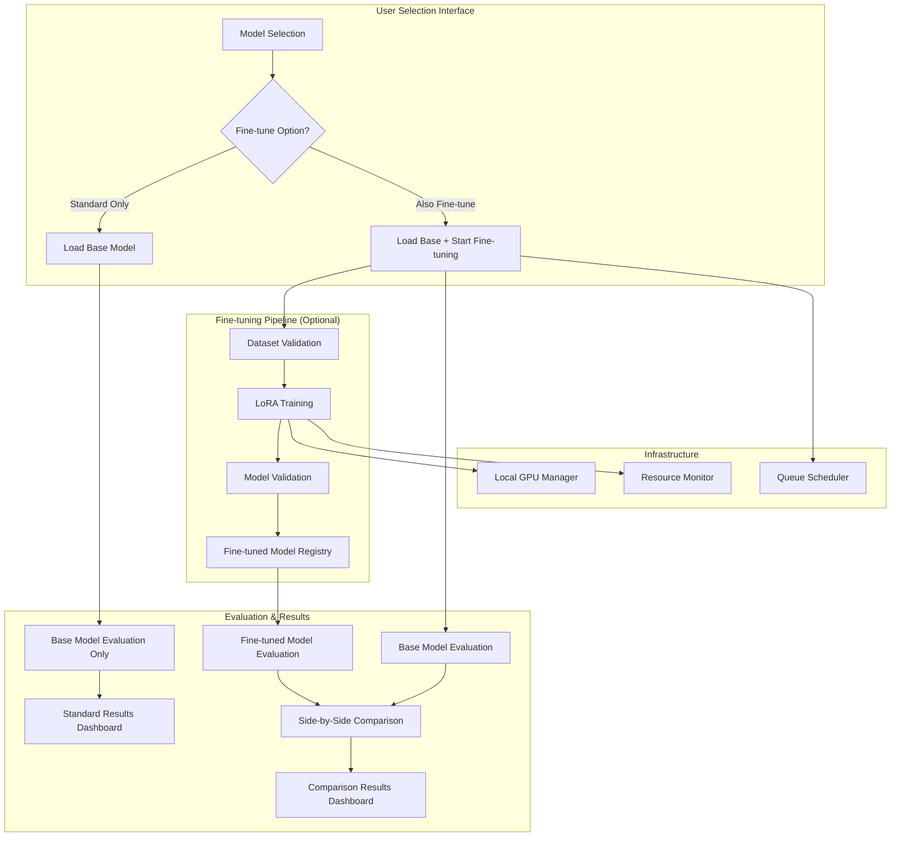

# Auto Fine-Tuning Feature: Architecture & Implementation Plan

## 🎯 Overview

This document outlines the design and implementation plan for adding **user-selectable auto fine-tuning capabilities** to the LLM Finance Leaderboard. Users can choose to evaluate models in their **out-of-the-box state** or **automatically fine-tune them** on proprietary financial datasets for direct performance comparison.

**Key Feature**: Side-by-side comparison of base models vs fine-tuned variants to measure the impact of domain-specific training.

## 📋 Requirements Summary

- **User Choice**: Optional fine-tuning - users select base model OR auto fine-tuned variant
- **Comparison Mode**: Side-by-side evaluation of base vs fine-tuned performance
- **Primary Focus**: LoRA/QLoRA fine-tuning for cost efficiency and speed
- **Target Models**: 7B-13B parameter models
- **Data Source**: Synthetic financial datasets from proprietary models
- **Security**: Local-only training infrastructure required
- **Integration**: Seamless integration with existing evaluation pipeline

## 🏗️ Architecture Design
## 🔄 User Workflow

### Model Selection Interface
```
┌─────────────────────────────────────────────────────────────┐
│ Model Selection for Benchmark                               │
├─────────────────────────────────────────────────────────────┤
│ Base Model: mistralai/Mistral-7B-Instruct-v0.1            │
│                                                             │
│ ● Use Base Model (Standard evaluation)                     │
│ ○ Also Fine-tune and Compare                               │
│                                                             │
│ Fine-tuning Options (when enabled):                        │
│ ├─ Dataset: Synthetic Finance Corpus v2                    │
│ ├─ Method: LoRA (Low-Rank Adaptation)                      │
│ ├─ Estimated Time: 3-4 hours                               │
│ └─ Hardware: RTX 4090 (24GB VRAM)                          │
│                                                             │
│ [Start Evaluation]                                          │
└─────────────────────────────────────────────────────────────┘
```

### Results Dashboard (when fine-tuning enabled)
```
┌─────────────────────────────────────────────────────────────┐
│ Model Performance Comparison                                │
├─────────────────────────────────────────────────────────────┤
│                    Base Model    Fine-tuned    Improvement  │
│ EPS Extraction        0.78          0.92         +18%      │
│ Sentiment Analysis    0.71          0.88         +24%      │
│ Revenue Analysis      0.65          0.84         +29%      │
│ Overall Score         0.71          0.88         +24%      │
│                                                             │
│ Training Time: 3.2 hours                                   │
│ Power Consumption: 1.8 kWh                                 │
│ Fine-tuning ROI: +24% performance improvement              │
│                                                             │
│ Note: Base model results are always shown as standard      │
└─────────────────────────────────────────────────────────────┘
```



## 🔧 Technical Considerations

### A. Training Infrastructure

**Compute Requirements:**
- **7B models**: ~16GB VRAM for QLoRA training
- **13B models**: ~24GB VRAM for QLoRA training
- **Training Time**: 2-4 hours (7B), 4-8 hours (13B)

**Local Hardware Requirements:**
- NVIDIA RTX 4090 (24GB VRAM) for 7B models
- NVIDIA A100 (40GB+ VRAM) for 13B models
- Multi-GPU support for larger models or parallel training
- Local queue management and resource allocation

**Memory Optimization:**
- QLoRA with 4-bit quantization reduces memory by ~75%
- LoRA adapters are 10-100MB vs multi-GB base models
- Gradient checkpointing for additional memory savings

### B. LoRA/QLoRA Implementation

**Technical Specifications:**
```yaml
lora_config:
  r: 16                    # Rank of adaptation
  lora_alpha: 32          # LoRA scaling parameter
  target_modules:         # Target attention layers
    - q_proj
    - v_proj
    - k_proj
    - o_proj
  lora_dropout: 0.1       # Dropout for LoRA layers
  bias: "none"            # Bias training strategy
  task_type: "CAUSAL_LM"  # Task type

quantization_config:
  load_in_4bit: true      # 4-bit quantization
  bnb_4bit_compute_dtype: "float16"
  bnb_4bit_quant_type: "nf4"
  bnb_4bit_use_double_quant: true
```

### C. Data Pipeline Integration

**Dataset Format Standardization:**
```json
{
  "instruction": "Analyze the following financial statement and extract the EPS value.",
  "input": "Q3 2024 earnings report: Revenue $2.1B, Net Income $150M, Shares Outstanding 50M",
  "output": "EPS = $150M / 50M = $3.00 per share"
}
```

**Quality Validation Pipeline:**
- Automated format validation
- Financial domain relevance scoring
- Data consistency checks
- Duplicate detection and removal

## ⚡ Local Resource Analysis

### Hardware Requirements & Training Times

| Model Size | GPU Requirement | VRAM Usage | Training Time | Power Consumption |
|------------|----------------|------------|---------------|-------------------|
| 7B         | RTX 4090       | 16GB       | 2-4 hours     | ~450W             |
| 13B        | A100 40GB      | 24GB       | 4-8 hours     | ~400W             |

**Resource Optimization Strategies:**
- Gradient checkpointing to reduce memory usage
- Mixed precision training (FP16/BF16)
- Efficient batch size selection based on available VRAM
- Local queue scheduling to maximize GPU utilization

## 🚀 Implementation Plan

### Phase 1: Core Infrastructure (Weeks 1-2)

#### 1.1 Training Configuration System
**Files to Create/Modify:**
- `src/config/training_config.yaml` - Training hyperparameters and infrastructure settings
- `src/config/settings.py` - Add training-related environment variables
- `src/data/schemas/data_models.py` - Add training job and dataset schemas

**Key Components:**
```python
@dataclass
class TrainingConfig:
    model_name: str
    dataset_path: str
    output_dir: str
    lora_config: LoRAConfig
    training_args: TrainingArguments
    local_gpu_ids: List[int]
    gpu_type: str
    max_power_watts: float
```

#### 1.2 Data Pipeline Enhancement
**Files to Create:**
- `src/data/processors/training_data_processor.py` - Synthetic dataset ingestion
- `src/data/validators/training_data_validator.py` - Data quality validation
- `src/data/formatters/instruction_formatter.py` - Convert to instruction-tuning format

### Phase 2: Training Engine (Weeks 3-4)

#### 2.1 LoRA/QLoRA Training Module
**Files to Create:**
- `src/training/lora_trainer.py` - Core LoRA training implementation
- `src/training/local_orchestrator.py` - Local training job management
- `src/training/resource_manager.py` - GPU resource allocation and monitoring
- `src/training/comparison_engine.py` - Base vs fine-tuned model comparison

**Key Features:**
- Integration with HuggingFace PEFT library
- 4-bit/8-bit quantization support
- Distributed training for larger models
- Automatic checkpoint saving and resumption

#### 2.2 Local Infrastructure
**Files to Create:**
- `src/infrastructure/local_gpu_manager.py` - Local GPU detection and allocation
- `src/infrastructure/resource_monitor.py` - Real-time resource tracking (GPU, memory, power)
- `src/infrastructure/queue_manager.py` - Training job queue and prioritization
- `src/infrastructure/thermal_monitor.py` - GPU temperature and throttling management

### Phase 3: Integration & Testing (Weeks 5-6)

#### 3.1 Model Registry Enhancement
**Files to Modify:**
- `src/models/model_loader.py` - Add fine-tuned model loading support
- `src/models/model_registry.py` - Auto-registration of trained models
- `src/config/models_config.yaml` - Dynamic model configuration updates

#### 3.2 Evaluation Pipeline Integration
**Files to Create:**
- `src/evaluation/auto_evaluator.py` - Automatic post-training evaluation
- `src/evaluation/model_comparator.py` - Base vs fine-tuned model comparison
- `streamlit_app/pages/training_dashboard.py` - Training monitoring UI
- `streamlit_app/pages/comparison_dashboard.py` - Side-by-side performance comparison

## 🛡️ Risk Mitigation

### Technical Risks

**Training Failures:**
- Robust checkpointing every 100 steps
- Automatic retry with exponential backoff
- Multi-cloud failover capabilities
- Training progress monitoring and early stopping

**Resource Constraints:**
- Dynamic GPU allocation based on availability
- Local resource monitoring and throttling
- Memory-based model selection
- Graceful degradation to CPU training if needed

**Model Quality Issues:**
- Automated validation gates (perplexity, benchmark scores)
- Human review checkpoints for critical models
- A/B testing framework for model comparison
- Rollback capabilities for failed deployments

### Operational Risks

**Resource Overuse:**
```python
# Local resource monitoring implementation
class LocalResourceMonitor:
    def __init__(self, max_power_watts: float, max_temp_celsius: float):
        self.max_power_watts = max_power_watts
        self.max_temp_celsius = max_temp_celsius
        self.current_power = 0.0
    
    def check_resources(self) -> bool:
        gpu_temp = self.get_gpu_temperature()
        gpu_power = self.get_gpu_power_usage()
        return gpu_temp < self.max_temp_celsius and gpu_power < self.max_power_watts
    
    def emergency_throttle(self):
        # Reduce training batch size or pause training
        pass
```

**Data Quality:**
- Comprehensive validation pipeline
- Statistical analysis of training data
- Manual review for edge cases
- Version control for datasets

## 📊 Success Metrics

### Performance Metrics
- **Training Success Rate**: >95% successful completion
- **Model Quality Improvement**: >10% average benchmark score increase
- **Training Time**: <4 hours (7B), <8 hours (13B)
- **Memory Efficiency**: <16GB VRAM for 7B models

### Operational Metrics
- **Resource Efficiency**: <450W power consumption for 7B model training
- **Queue Wait Time**: <2 hours during normal operations
- **Integration Success**: 100% automatic registration and evaluation
- **Hardware Utilization**: >80% GPU utilization during training

### Business Metrics
- **Research Velocity**: 5x increase in model experimentation capacity
- **Leaderboard Diversity**: 50+ unique fine-tuned model variants
- **User Adoption**: 80% of researchers using auto fine-tuning feature
- **Hardware ROI**: 3x improvement in research output per hardware investment

## 🔄 Integration with Existing System

### Model Configuration Extension
```yaml
# Addition to src/config/models_config.yaml
auto_finetuned_models:
  custom_mistral_finance_v2:
    name: "auto-ft-mistral-7b-finance-20241225"
    display_name: "Auto Fine-tuned Mistral 7B Finance v2"
    parameters: "7B"
    base_model: "mistralai/Mistral-7B-Instruct-v0.1"
    lora_path: "models/auto_finetuned/mistral_finance_v2"
    training_dataset: "synthetic_finance_corpus_v2"
    training_date: "2024-12-25"
    power_consumption_kwh: 1.8
    benchmark_scores:
      eps_extraction: 0.92
      sentiment_analysis: 0.88
      overall_score: 0.90
```

### API Endpoints
```python
# New endpoints for training management
@app.post("/api/training/submit")
async def submit_training_job(config: TrainingConfig):
    """Submit a new fine-tuning job"""
    pass

@app.get("/api/training/status/{job_id}")
async def get_training_status(job_id: str):
    """Get training job status and progress"""
    pass

@app.get("/api/training/resources")
async def get_training_resources():
    """Get current GPU usage and power consumption"""
    pass

@app.get("/api/models/compare/{base_model_id}/{finetuned_model_id}")
async def compare_models(base_model_id: str, finetuned_model_id: str):
    """Compare performance between base and fine-tuned model"""
    pass

@app.post("/api/evaluation/run_comparison")
async def run_model_comparison(models: List[str], auto_finetune: bool = False):
## 🎛️ User Interface Design

### Model Selection Component
```python
# streamlit_app/components/model_selector.py
class ModelSelector:
    def render(self):
        st.subheader("Model Configuration")
        
        # Base model selection
        base_model = st.selectbox(
            "Select Base Model",
            options=["mistralai/Mistral-7B-Instruct-v0.1", "meta-llama/Llama-2-7b-chat-hf"]
        )
        
        # Fine-tuning option
        finetune_option = st.radio(
            "Evaluation Mode",
            options=[
                "Base Model (Standard evaluation)",
                "Also Fine-tune and Compare"
            ]
        )
        
        if finetune_option == "Also Fine-tune and Compare":
            st.info("Fine-tuning will take 3-4 hours for 7B models")
            
            # Fine-tuning configuration
            with st.expander("Fine-tuning Configuration"):
                dataset = st.selectbox("Dataset", ["Synthetic Finance Corpus v2"])
                method = st.selectbox("Method", ["LoRA", "QLoRA"])
                
                col1, col2 = st.columns(2)
                with col1:
                    st.metric("Estimated Time", "3-4 hours")
                with col2:
                    st.metric("GPU Required", "RTX 4090 24GB")
        
        return {
            "base_model": base_model,
            "finetune_option": finetune_option,
            "dataset": dataset if finetune_option == "Also Fine-tune and Compare" else None
        }
```

### Comparison Results Component
```python
# streamlit_app/components/comparison_results.py
class ComparisonResults:
    def render(self, base_results, finetuned_results):
        st.subheader("Model Performance Comparison")
        
        # Create comparison table
        comparison_data = {
            "Metric": ["EPS Extraction", "Sentiment Analysis", "Revenue Analysis", "Overall Score"],
            "Base Model": [0.78, 0.71, 0.65, 0.71],
            "Fine-tuned": [0.92, 0.88, 0.84, 0.88],
            "Improvement": ["+18%", "+24%", "+29%", "+24%"]
        }
        
        df = pd.DataFrame(comparison_data)
        st.dataframe(df, use_container_width=True)
        
        # Performance visualization
        col1, col2 = st.columns(2)
        
        with col1:
            fig = px.bar(
                df, 
                x="Metric", 
                y=["Base Model", "Fine-tuned"],
                title="Performance Comparison",
                barmode="group"
            )
            st.plotly_chart(fig, use_container_width=True)
        
        with col2:
            st.metric("Training Time", "3.2 hours")
            st.metric("Power Consumption", "1.8 kWh")
            st.metric("Performance Gain", "+24%", delta="24%")
            
            # ROI calculation
            roi = ((0.88 - 0.71) / 0.71) * 100
            st.metric("Fine-tuning ROI", f"+{roi:.1f}%")
```
    """Run evaluation with optional auto fine-tuning"""
    pass
```

## 🎯 Next Steps

### Immediate Actions (Week 1)
1. **Hardware Assessment**: Evaluate available local GPU resources and cooling capacity
2. **Technical Setup**: Set up development environment with PEFT and quantization libraries
3. **Data Preparation**: Analyze synthetic dataset format and create conversion pipeline
4. **Infrastructure Planning**: Design local resource monitoring and queue management

### Short-term Goals (Weeks 2-4)
1. **MVP Implementation**: Basic LoRA training with manual job submission
2. **Resource Monitoring**: Real-time GPU usage, temperature, and power tracking
3. **Quality Gates**: Automated model validation and benchmark integration
4. **Documentation**: User guides and API documentation

### Long-term Vision (Months 2-6)
1. **Advanced Features**: Hyperparameter optimization, multi-objective training
2. **Scalability**: Support for larger models (20B+) and distributed training
3. **Research Tools**: Experiment tracking, model comparison, and analysis tools
4. **Community Features**: Shared model repository and collaborative training

## 📚 Technical Dependencies

### Required Libraries
```txt
# Training and Fine-tuning
transformers>=4.35.0
peft>=0.6.0
bitsandbytes>=0.41.0
accelerate>=0.24.0
datasets>=2.14.0

# Local Infrastructure
nvidia-ml-py3>=12.535.0  # NVIDIA GPU monitoring
psutil>=5.9.0           # System resource monitoring
GPUtil>=1.4.0           # GPU utilities

# Monitoring and Logging
wandb>=0.16.0
tensorboard>=2.15.0
prometheus-client>=0.19.0
```

### Infrastructure Requirements
- **Development**: 1x RTX 4090 24GB for testing and validation
- **Production**: 1-2x A100 40GB/80GB or multiple RTX 4090s
- **Storage**: 1TB+ NVMe SSD for model checkpoints and datasets
- **Cooling**: Adequate ventilation and cooling for sustained GPU usage
- **Power**: 850W+ PSU for single RTX 4090, 1200W+ for multiple GPUs

This architecture provides a robust, scalable foundation for auto fine-tuning capabilities while maintaining cost efficiency and seamless integration with the existing LLM Finance Leaderboard system.